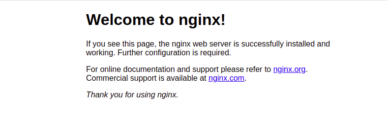
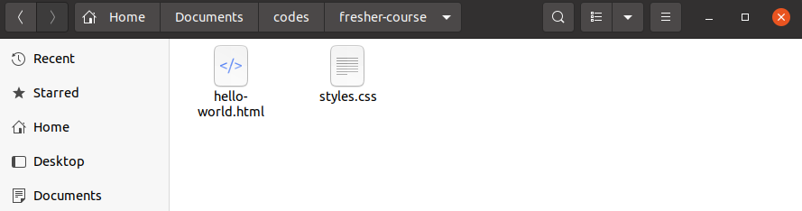
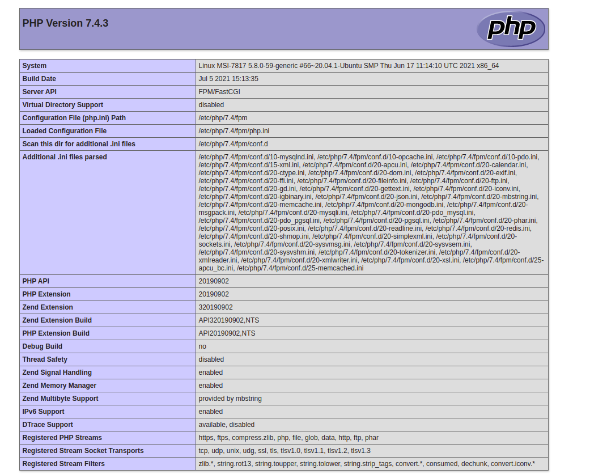

# Cài đặt môi trường

## Tổng quan
- Code HTML, CSS cần có môi trường để chạy, code PHP và MySQL đương nhiên cũng vậy.
- Bài này sẽ hướng dẫn các bạn cài đặt môi trường chạy PHP và MySQL theo cách tiêu chuẩn. Vì các bạn sử dụng Ubuntu-Linux nên các bạn có thể tưởng tượng được trên môi trường server thật, code của các bạn cũng sẽ được deploy như vậy.

## Danh sách software cần cài
- MySQL: Database - RDBMS MySQL.
- MySQL workbench: MySQL client giúp bạn dễ dàng quản lý và chạy lệnh MySQL trên máy (Mặc định MySQL chạy lệnh qua command).
- PHP + PHP Extensions: Đương nhiên.
- Nginx (Đọc là Engine Ex): Webserver.

##### PHP sẽ không chạy độc lập, mà chạy trên môi trường là một Webserver (Nginx hoặc Apache), sử dụng Database là MySQL, và hệ điều hành tối ưu nhất cho chúng là Linux. Kết hợp chúng lại, chúng ta có khái niệm là LEMP stack(Linux - Engine Ex - MySQL - PHP) hoặc  LAMP stack(Linux - Apache - MySQL - PHP).
Nếu bạn muốn tìm hiểu thêm về webserver, có thể đọc thêm [tại đây](https://viblo.asia/p/tim-hieu-va-huong-dan-setup-web-server-nginx-OREGwBwlvlN)

## Cài đặt MySQL
- Các bạn cài đặt MySQL [theo hướng dẫn](https://www.digitalocean.com/community/tutorials/how-to-install-mysql-on-ubuntu-20-04).
- Yêu cầu: Cài đặt được MySQL, truy cập được vào mysql bằng tài khoản + mật khẩu (tài khoản root hoặc tài khoản tạo mới).

## Cài đặt MySQL Workbench
- Tải và cài đặt MySQL Workbench [từ đường dẫn](https://dev.mysql.com/downloads/workbench/)
- Yêu cầu: Cài đặt được MySQL Workbench, kết nối được đến MySQL nhờ tài khoản từ bước trước.

## Cài đặt PHP
- Có khá nhiều hướng dẫn trên mạng, bạn có thể tham khảo thêm, nhưng ở đây tôi sẽ tổng hợp đơn giản cách cài đặt cho Ubuntu 20.04.

```
$ sudo apt-get update
```
```
$ sudo apt-get install php-fpm php-common php-opcache php-apcu php-cli php-pear php-mysql php-pgsql php-mongodb php-redis php-memcache php-memcached php-gd php-mbstring php-xml
```

- Chọn `Y` nếu được hỏi có cài đặt hay không.
- Sau khi cài đặt xong, kiểm tra lại bằng lệnh:
```
$ systemctl status php7.4-fpm
php7.4-fpm.service - The PHP 7.4 FastCGI Process Manager
     Loaded: loaded (/lib/systemd/system/php7.4-fpm.service; enabled; vendor preset: enabled)
     Active: active (running) since Tue 2020-06-09 19:07:05 UTC; 37s ago
```

## Cài đặt nginx

- Cập nhật repository
```
$ sudo apt-get update
```

- Cài đặt nginx
```
$ sudo apt-get install nginx
```

- Kiểm tra lại (version có thể mới hơn)
```
$ sudo nginx -v
nginx version: nginx/1.6.2
```

- Cài đặt để nginx tự động startup khi máy khởi động lại
```
$ systemctl start nginx.service
$ systemctl enable nginx.service
```

- Truy cập đường dẫn: [http://localhost](http://localhost). Nếu thấy hiển thị như bên dưới, vậy là bạn đã cài đặt nginx thành công



## Config Nginx và PHP

- Đầu tiên, đưa toàn bộ code frontend của bạn vào một thư mục. VD: `/home/<username>/Documents/codes/fresher-course`



- Điều hướng đến thư mục config của Nginx

```
$ cd /etc/nginx
$ ls
conf.d          koi-win            nginx.conf       sites-enabled
fastcgi.conf    mime.types         proxy_params     snippets
fastcgi_params  modules-available  scgi_params      uwsgi_params
koi-utf         modules-enabled    sites-available  win-utf
```

- Các bạn có thể thấy khá nhiều file/directory tại đây, nhưng trong phần này chúng ta chỉ quan tâm đến 2 mục:
    - nginx.conf - File config chung của nginx.
    - sites-enabled - Thư mục chứa config cho các websites khác biệt.
    
- Chúng ta sẽ config một domain để chạy websites trong thư mục codes đã tạo bên trên.

```
$ cd site-enabled
$ sudo gedit fresher.course.conf
```

**Lưu ý: tên file có thể đặt khác, chỉ cần file extension có dạng *.conf là được**

Điền vào file trên nội dung

```
server {
	listen 80;
	listen [::]:80;

	root /home/<user>/Documents/codes/fresher-course; # folder path of codes
	
	# Add index.php to the list if you are using PHP
	index index.html index.php index.htm index.nginx-debian.html;

	server_name fresher.course.com; # domain name of websites, you can place any domain you want

	location / {
		# First attempt to serve request as file, then
		# as directory, then fall back to displaying a 404.
		try_files $uri $uri/ /index.php?$args;
	}

	# pass PHP scripts to FastCGI server
	#
	location ~ \.php$ {
		include snippets/fastcgi-php.conf;
	
		# With php-fpm (or other unix sockets):
		fastcgi_pass unix:/run/php/php7.4-fpm.sock;
		# With php-cgi (or other tcp sockets):
		# fastcgi_pass 127.0.0.1:9000;
	}

	# deny access to .htaccess files, if Apache's document root
	# concurs with nginx's one
	#
	location ~ /\.ht {
		deny all;
	}
}
```

**Lưu ý: Nhớ chỉnh sửa dòng `root ...` thành đường dẫn của thư mục chứa code

Chạy
```
$ sudo service nginx restart
```

Để truy cập được vào domain đã config tại dòng server_name, cần phải chỉ định ip của local khi máy tính yêu cầu domain đã config.

```
$ sudo gedit /etc/hosts
```

Sửa
```
127.0.0.1	localhost
```
Thành
```
127.0.0.1	localhost fresher.course.com
```

Lưu và thoát.

Mở trình duyệt, truy cập vào đường dẫn [http://fresher.course.com/hello-world.html](http://fresher.course.com/hello-world.html). Nếu truy cập được, vậy bạn đã config Nginx thành công.

#### Mở lại folder chứa code, tạo một file mới có tên `info.php` với nội dung

```php
<?php
phpinfo();
```

Truy cập vào đường dẫn [http://fresher.course.com/info.php](http://fresher.course.com/info.php).

Nếu nội dung hiển thị giống hình dưới, vậy bạn đã config Nginx chạy code PHP thành công

