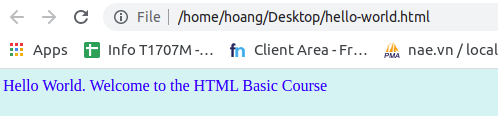
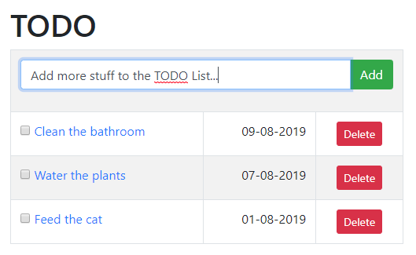

# CSS cơ bản

CSS là chữ viết tắt của Cascading Style Sheets, nó là một ngôn ngữ được sử dụng để tìm và định dạng lại các phần tử được tạo ra bởi các ngôn ngữ đánh dấu (HTML).
Nói ngắn gọn hơn là ngôn ngữ tạo phong cách cho trang web. Bạn có thể hiểu đơn giản rằng, nếu HTML đóng vai trò định dạng các phần tử trên website như việc tạo ra các đoạn văn bản, các tiêu đề, bảng,…thì CSS sẽ giúp chúng ta có thể thêm style vào các phần tử HTML đó như đổi bố cục, màu sắc trang, đổi màu chữ, font chữ, thay đổi cấu trúc…

## Mục tiêu sau bài học

- Hiểu được khái niệm CSS.
- Biết dùng một số thuộc tính CSS cơ bản.
- Chỉnh sửa được giao diện Todolist bằng css theo yêu cầu.

## Inline style

- Trong bài trước, chúng ta đã cùng bắt đầu với web page hello world đơn giản. Nếu bạn không nhớ, hãy xem lại [tại đây](./html.md#webpage-hello-world)
- Hãy bắt đầu làm quen với css bằng cách chỉnh sửa file html trên thành:
```html
<!doctype html>
<html lang="en">
<head>
    <meta charset="UTF-8">
    <meta name="viewport"
          content="width=device-width, user-scalable=no, initial-scale=1.0, maximum-scale=1.0, minimum-scale=1.0">
    <meta http-equiv="X-UA-Compatible" content="ie=edge">
    <title>Hello World</title>
</head>
<body style="color: blue; background-color: #d3f3f3">
  Hello World. Welcome to the HTML Basic Course
</body>
</html>
```

Giao diện sẽ được hiển thị giống như hình dưới:



Đây là cách sử dụng css đầu tiên: `Inline style`

## Internal CSS
Tiếp tục chỉnh sửa file trên thành
```html
<!doctype html>
<html lang="en">
<head>
    <meta charset="UTF-8">
    <meta name="viewport"
          content="width=device-width, user-scalable=no, initial-scale=1.0, maximum-scale=1.0, minimum-scale=1.0">
    <meta http-equiv="X-UA-Compatible" content="ie=edge">
    <title>Hello World</title>

    <style>
      body {
        color: blue;
        background-color: #d3f3f3;
      }
    </style>
</head>
<body>
  Hello World. Welcome to the HTML Basic Course
</body>
</html>
```

- Như các bạn quan sát được, với Internal CSS, chúng ta chỉ cần thêm một thẻ style vào bên trong header của html.
- `body` ở đây là selector, chỉ định thuộc tính viết bên trong sẽ áp dụng cho thẻ body.
- color và background color là properties, giúp chúng ta chỉnh sửa cách mà html hiển thị nội dung. Giống như cách inline style thực hiện.

## External CSS

- Ngoài cách nhúng thẳng style vào trình duyệt như bên trên, chúng ta còn có cách thứ 3 đó là dùng external file.
- Đầu tiên, hãy tạo một file `styles.css` nằm cùng thư mục với file `hello-world.html`
- Điền nội dung css vào trong file `styles.css`
```css
body {
    color: blue;
    background-color: #d3f3f3;
}
```
- File `hello-world.html` sửa thành
```html
<!doctype html>
<html lang="en">
<head>
    <meta charset="UTF-8">
    <meta name="viewport"
          content="width=device-width, user-scalable=no, initial-scale=1.0, maximum-scale=1.0, minimum-scale=1.0">
    <meta http-equiv="X-UA-Compatible" content="ie=edge">
    <title>Hello World</title>

    <link rel="stylesheet" href="./styles.css">
</head>
<body>
  Hello World. Welcome to the HTML Basic Course
</body>
</html>
```
- Chúng ta có trang Hello World với hiển thị không đổi.

## Lợi ích của dùng external css file
Trong thực thế, css của chúng ta không chỉ được sử dụng ở một trang duy nhất, mà còn được sử dụng lại ở rất nhiều trang. VD: trang chủ và trang giới thiệu của website bạn đang sử dụng đều sử dụng cùng một style - cùng font chữ, cùng màu chữ, cùng màu background... 

Nếu nhúng thẳng vào trong trang như cách dùng `inline style` và `internal css`, việc sử dụng lại code là rất khó, nhưng `external css` lại giải quyết vấn đề này một cách dễ dàng.

## Video học liệu

Tiếp tục quay lại với [https://khanacademy.com](https://www.khanacademy.org/), chúng ta sẽ cùng tìm hiểu và thực hành nhanh về css.

### Tổng quan css
- [Video](https://www.khanacademy.org/computing/computer-programming/html-css/intro-to-css/pt/css-basics): (05:06)
- [Tổng kết nhanh](https://www.khanacademy.org/computing/computer-programming/html-css/intro-to-css/a/quick-tip-selecting-by-tag-name)
- [Thử thách - Bài tập](https://www.khanacademy.org/computing/computer-programming/html-css/intro-to-css/pc/challenge-colorful-creature)

### Select bằng id
- [Video](https://www.khanacademy.org/computing/computer-programming/html-css/intro-to-css/pt/css-selecting-by-id): (04:24)
- [Thử thách - Bài tập](https://www.khanacademy.org/computing/computer-programming/html-css/intro-to-css/pc/challenge-seasonal-ids)

### Select bằng class
- [Video](https://www.khanacademy.org/computing/computer-programming/html-css/intro-to-css/pt/css-selecting-by-class): (03:59)
- [Thử thách - Bài tập](https://www.khanacademy.org/computing/computer-programming/html-css/intro-to-css/pc/challenge-apples-and-bananas-classes)

## Học liệu bổ sung
- Nếu bạn vẫn muốn tiếp tục với chuỗi video học liệu để bổ sung thêm kiến thức về CSS, các bạn có thể tham khảo tại:
    + [CSS Text Properties](https://www.khanacademy.org/computing/computer-programming/html-css/css-text-properties/pt/css-font-family-property)
    + [CSS Layout](https://www.khanacademy.org/computing/computer-programming/html-css/css-layout-properties/pt/css-grouping-elements)
    + [More CSS Selector](https://www.khanacademy.org/computing/computer-programming/html-css/more-css-selectors/pt/using-multiple-css-classes)
    
- Các thuộc tính css được liệt kê đầy đủ [tại đây](https://www.w3schools.com/cssref/css3_pr_align-content.asp)

## Bài tập tổng kết
- Hãy kết hợp tất cả những thứ mà bạn đã học, cùng việc tự tìm hiểu, research, hóng heart hỏi han men tồ, chỉnh sửa giao diện todolist từ bài trước giống hình bên dưới.



- Đẩy code lên git, và deploy lên github pages.