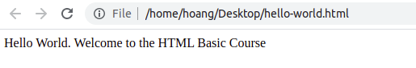
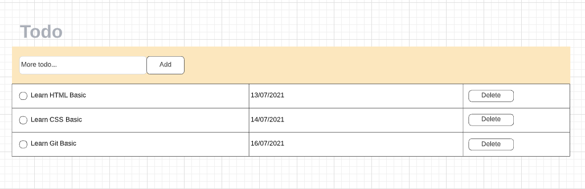

# HTML cơ bản

HTML viết tắt của Hypertext Markup Language. Là ngôn ngữ lập trình dùng để xây dựng và cấu trúc lại các thành phần có trong Website.

## Mục tiêu sau bài học

- Hiểu được khái niệm HTML.
- Biết dùng một số thẻ HTML đơn giản.
- Tạo được giao diện Todo List theo yêu cầu.

## Webpage Hello World

Thực hiện thao tác theo từng bước sau:

 - Mở Text Editor/IDE (Ứng dụng VSCode đã cài từ bước trước).
 - Ấn tổ hợp phím `Ctrl + N` để mở cửa sổ mới.
 - Nhập đoạn code sau vào Editor:

```html
<!doctype html>
<html lang="en">
<head>
    <meta charset="UTF-8">
    <meta name="viewport"
          content="width=device-width, user-scalable=no, initial-scale=1.0, maximum-scale=1.0, minimum-scale=1.0">
    <meta http-equiv="X-UA-Compatible" content="ie=edge">
    <title>Hello World</title>
</head>
<body>
  Hello World. Welcome to the HTML Basic Course
</body>
</html>
```

 - Save lại nội dung trên vào một file có định dạng *.html (VD: hello-world.html)
 - Mở file trên bằng trình duyệt Chrome.
 - Bạn sẽ thấy nội dung được hiển thị như sau:



 - Vậy là bạn đã tạo được trang web đầu tiên rồi. Chúc mừng bạn.

## Video học liệu

- Học liệu được tổng hợp từ [https://khanacademy.com](https://www.khanacademy.org/). Nơi tôi cũng từng học vỡ lòng.
- Các bạn có thể vừa xem, vừa thực hành ngay, bằng cách tạm dừng và gõ code ngay trên video đang hiển thị.

### Tổng quan HTML
 - [Video](https://www.khanacademy.org/computing/computer-programming/html-css/intro-to-html/pt/html-basics): (04:43)
 - [Quick Tip: HTML tags](https://www.khanacademy.org/computing/computer-programming/html-css/intro-to-html/a/quick-tip-html-tags)
 - [Thử thách: Làm thơ](https://www.khanacademy.org/computing/computer-programming/html-css/intro-to-html/pc/challenge-write-a-poem)

### Text emphasis
 - [Video](https://www.khanacademy.org/computing/computer-programming/html-css/intro-to-html/pt/html-text-emphasis): (02:04)
 - [Thử thách: Markup Text](https://www.khanacademy.org/computing/computer-programming/html-css/intro-to-html/pc/challenge-you-can-learn-text-tags)

### List
 - [Video](https://www.khanacademy.org/computing/computer-programming/html-css/intro-to-html/pt/html-lists): (02:50)
 - [Thử thách: Wish List](https://www.khanacademy.org/computing/computer-programming/html-css/intro-to-html/pc/challenge-your-learning-list)

### Ảnh
 - [Video](https://www.khanacademy.org/computing/computer-programming/html-css/intro-to-html/pt/html-images): (04:43)
 - [Thử thách: Nhúng ảnh](https://www.khanacademy.org/computing/computer-programming/html-css/intro-to-html/pc/challenge-a-picture-perfect-trip)

## Học liệu bổ sung
 - Nếu bạn vẫn muốn tiếp tục với chuỗi video học liệu để bổ sung thêm kiến thức về HTML, các bạn có thể tham khảo tại:
    + [More HTML tags](https://www.khanacademy.org/computing/computer-programming/html-css/html-tags-continued/pt/html-links)

 - Tài liệu gần như đầy đủ của các thẻ HTML được liệt kê [tại đây](https://www.w3schools.com/tags/default.asp).
 - Một số thẻ hay sử dụng cần được ghi nhớ: `<div>`, `<p>`, `<span>`, `<ul>`, `<li>`, `<form>`, `<input>`, `<button>`, `<table>`

## Bài tập tổng kết
- Hãy kết hợp tất cả những thứ mà bạn đã học, cùng việc tự tìm hiểu, research, hóng heart hỏi han men tồ, tạo ra một trang web Todolist bằng html, với giao diện được bố trí giống như hình bên dưới

