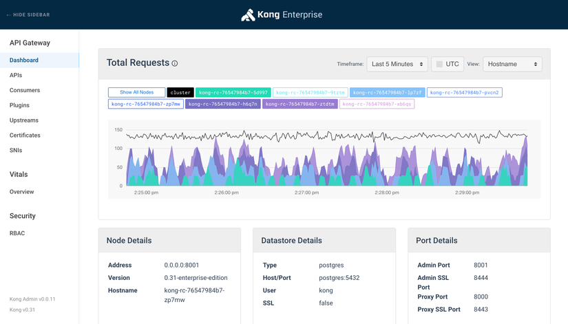

# Tổng quan

## Api Gateway là gì?

API Gateway có thể coi là một cổng trung gian, nó là cổng vào duy nhất tới hệ thống microservices của chúng ta, api gateway sẽ nhận các requests từ phía client, chỉnh sửa, xác thực và điều hướng chúng đến các API cụ thể trên các services phía sau.

## Tại sao lại cần Api Gateway?

### Che dấu được cấu trúc của hệ thống microservices với bên ngoài
Clients sẽ tương tác với hệ thống của chúng ta thông qua api gateway chứ không gọi trực tiếp tới một services cụ thể, các endpoints của các services sẽ chỉ được gọi nội bộ, tức là gọi giữa các services với nhau hoặc được gọi từ API gateway, người dùng sẽ gọi các api này thông qua các public endpoints từ API Gateway. Chính vì vậy cho nên phía client không cần và cũng không thể biết được các services phía backend được phân chia như thế nào, việc refactor code frontend cũng dễ dàng hơn đối với lập trình viên.

### Phần code phía frontend sẽ gọn gàng hơn
Vì không phải tracking nhiều endpoints, tất cả chỉ việc gọi đến api gateway nên phần code frontend sẽ gọn gàng hơn so với việc phải tracking hàng tá endpoints trên từng services một, nhất là khi mà hệ thống ngày một phình to ra.

### Dễ dàng theo dõi và quản lý traffic.
Hầu hết các hệ thống API gateway phổ biến hiện nay đều sẽ đi kèm tính năng theo dõi và quản lý lượng traffic bằng GUI hoặc thông qua các APIs của hệ thống Gateway, VD như với Kong (bản EE)

### Requests caching và cân bằng tải. 
API Gateway sẽ kiêm luôn vai trò load balancer của hệ thống, requests sẽ không được gửi trực tiếp đến backend nên sẽ giảm thiểu được rủi ro hệ thống bị quá tải.

### Thêm một lớp bảo mật nữa cho hệ thống.
API gateway giúp ngăn chặn các cuộc tấn công bằng cách thêm một lớp bảo vệ các loại tấn công như ddos, slq injections,...

### Thay thế authentication services
API gateway thường cung cấp nhiều cơ chế xác thực, chúng ta có thể sử dụng nó để xác thực người dùng luôn, giúp tiết kiệm thời gian và làm hệ thống chúng ta đơn giản hơn. Hoặc có thể tích hợp trực tiếp với keycloak, okta,... tránh việc phải implement auth tại mỗi service.

### Và rất nhiều ưu điểm khác với tùy loại API Gateway
