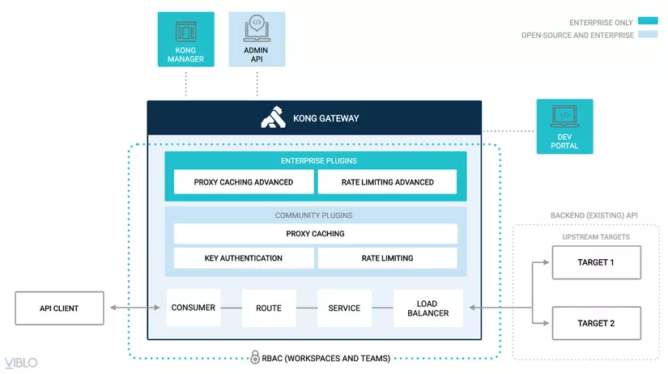
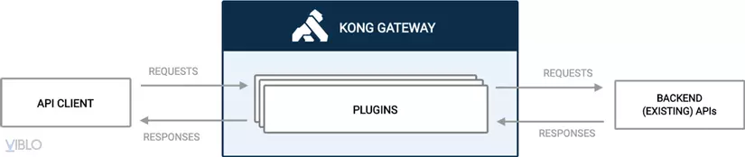

# Kong Gateway

## Kong là gì?

Kong Gateway cũng giống như các API Gateway khác, nó nhẹ, được dùng cho microservices, có độ trễ thấp, hiệu suất cao và
scalability.

## Ưu điểm của Kong

### Khả năng mở rộng dễ dàng

Kong server là stateless, chúng ta có thể thêm hoặc xóa bao nhiêu nodes tùy ý, miễn là chúng trỏ vào 1 datastores. Kong
Datastore có thể chọn 1 trong 2 loại DB

Postgres: khi muốn xây dựng một hệ thống Api Gateway tập chung, đơn giản, hiệu năng tốt. Mặc định thì Kong sẽ sử dụng
Postgres làm datastore.

Cassandra: Dùng cassandra khi muốn xây dựng một hệ thống api gateway phân tán, tính khả dụng cao, chịu tải tốt, dễ dàng
scale. Cassandra sẽ chạy tốt nhất trên các server có cấu hình mạnh.

### Hiệu năng khủng

Trong các bài test performance thì Kong là một trong những API Gateway có hiệu năng cao nhất, nó có thể xử lý được một
lượng rất lớn requests / s

### Nhiều plugins

Kong hỗ trợ rất nhiều plugins tùy vào chức năng như authen, logging, traffic control, analytics & monitoring...giúp quản
lý cũng như theo dõi các microservices được hiệu quả và dễ dàng hơn thay vì chỉ đảm nhận mỗi việc routing requests.

### Miễn phí

Kong có bản miễn phí, nhưng không có GUI. Có thể dùng konga để làm gui thay thế.

## Kiến trúc

###  

| Object               |    Describe                                                       |
| -------------------- | --------------------------------------------------------------------- |
| Service              | Là ID dùng để tham chiếu đến các API và microservice mà nó quản lý |
| Routes               | Điều hướng cách request gửi tới Services khi nó tới API gateway. 1 Service có thể có nhiều Routes |
| Consumers            | Đại diện cho end users của API. Nó control ai được access vào API. Nó có thể ghi log lại |
| Admin API            | RESTful API Dùng để thêm, sửa xóa các config thông qua http request   |
| Plugins              | Các Plugins tích hợp vào Kong |
| Rate Limiting plugin |    Limit số lượng HTTP requests tới trong 1 khoảng thời gian |
| Proxy Caching plugin |    Proxy Cache - cái tên nói lên công dụng |
| Load Balancing |    Có 2 method là DNS-based or vòng tròn (ring-balancer) |

## Traffic flow

Mặc định Kong listen port 8000 (HTTP) hoặc 8443 (HTTPS) (có thể config). Nó nhận request API từ client và Routes chúng đến API destination. Trong lúc đó, các policy được áp dụng.

## Tạm kết

Đây chỉ là phần lý thuyết để hiểu hơn về cơ chế và các khái niệm cơ bản của Kong. Bài
