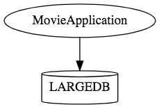
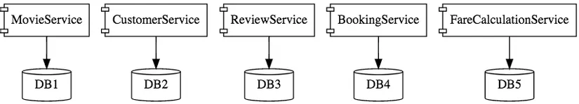

# Introduction

## Microservices là gì

Thực tế có nhiều định nghĩa khác nhau đối với Microservices nhưng hiểu theo cách đơn giản thì, microservice là một kiếu kiến trúc phần mềm. Các module trong phần mềm này được chia thành các service rất nhỏ (microservice). Mỗi service sẽ được đặt trên một server riêng -> dễ dàng để nâng cấp và scale ứng dụng.

## Kiến trúc Microservices
Khác biệt với kiến trúc Monolith, hay vì gom tất cả module thành một khối (monolith), ta tách các module thành những service siêu nhỏ. Mỗi service sẽ được đặt trên một server riêng (Có thể dùng server cloud như AWS hoặc Azure), giao tiếp với nhau thông qua mạng (Gửi nhận message qua giao thức HTTP hoặc sử dụng MessageQueue)...

```text
Hình dưới đây sẽ minh họa cho việc phần mềm được xây dựng theo kiến trúc Monolith, một ứng dụng sẽ chứa tất cả các thành phần
```


```text
Còn hình dưới sẽ minh họa việc ứng dụng ở trên khi được xây dựng theo kiến trúc Microservices
```

VD: [https://vnexpress.net/](https://vnexpress.net/) hàng ngày có đến hàng ngàn bài báo được tạo mới, tương ứng với đó là hàng ngàn webpages mới mỗi ngày.

## Các ưu điểm của Kiến trúc Microservices
Hiện nay, các ứng dụng thường rất lớn và liên tục được update ví dụ như facebook, linkin,... . Với kiến trúc monolith, việc gom toàn bộ ứng dụng vào một khối làm việc nâng cấp trở nên khó khăn và mất thời gian. Để giải quyết vấn đề đó, các ứng dụng lớn cần thiết được tách ra thành các service nhỏ. Mỗi service quản lý một cơ sở dữ liệu riêng, nằm trên một server riêng, tách biệt hoàn toàn với nhau. Các ưu điểm như sau:

- Điều quan trọng nhất là rất dễ nâng cấp và scale up, scale down.
- Giả sử bạn làm một trang web liên quan tới vận tải, kho bãi. Khi số lượng xe hay hàng hóa tăng lên, chỉ việc nâng cấp server cho service liên quan đến nghiệp vụ kho vận(ngược lại, có thể giảm server nếu cần thiết). 
- Với cloud computing, việc nâng cấp server vô cùng dễ dàng chỉ với vài cú click chuột. Điều này rất khó thực hiện với monolith.
- Do tách biệt nên nếu một service bị lỗi, toàn bộ hệ thống vẫn hoạt động bình thường. Với monolith, một module bị lỗi có thể sẽ kéo sập toàn bộ hệ thống.
- Các service nằm tách biệt nhau, chúng có thể được sử dụng các ngôn ngữ lập trình riêng, database riêng. VD service xử lý ảnh có thể viết bằng C++, service tổng hợp data có thể viết bằng Python.
- Có thể áp dụng được các quy trình tự động hóa, như build, deploy, monitoring,...
- Khi chia nhỏ các service, team size sẽ giảm và mọi người sẽ làm việc hiệu quả hơn.
- ...

## Tuy nhiên không phải là không có nhược điểm
- Các module giao tiếp qua mạng nên có thể tốc độ không cao bằng monolith. 
- Ngoài ra, mỗi module phải tự giải quyết các vấn đề về bảo mật, transaction, lỗi kết nối, quản lý log files.
- Việc đảm bảo tính đồng nhất trong dữ liệu sẽ trở nên phức tạp hơn.
- Sử dụng nhiều service nên việc theo dõi, quản lý các service này sẽ phức tạp hơn.
- Cần một đội ngũ thật ngon để thiết kế và triển khai bao gồm software architect xịn.

Vấn đề đặt ra:
- Chẳng lẽ với mỗi bài báo như vậy, chúng ta lại tạo ra một trang html tương ứng? Rõ ràng là người viết báo, đại đa số đều không biết code, càng đừng nói đến deploy, vì họ **không được phép truy cập vào server**.
- Tương tự, việc chỉnh sửa nội dung cũng là bất khả thi, và càng khó khăn hơn khi cần tìm đúng nội dung đã viết trước đó để sửa.
- Mỗi bài viết đều gắn với một ký giả/nhà báo nhất định, và họ cũng chỉ có thể quản lý, chỉnh sửa bài viết do chính mình tạo ra, vậy phải quản lý thế nào nếu tất cả webpage đều được đẩy lên cùng một chỗ.
- Và còn nhiều vấn đề khác,...

## Tổng kết

- Việc xây dựng phần mềm theo kiến trúc nào hoàn toàn phụ thuộc vào phạm vi bài toán mà ứng dụng đó đặt ra. Monolith phù hợp với các ứng dụng cỡ vừa và nhỏ, còn Microservices sẽ phù hợp với những ứng dụng lớn => chúng ta cần cân nhắc cẩn thận khi sử dụng để tránh trường hợp mang dao mổ trâu đi thịt gà.
- TopCV IOS là một dự án lớn và long term, vì vậy việc áp dụng microservices vào dự án này là thích hợp và nên là lựa chọn hàng đầu.
